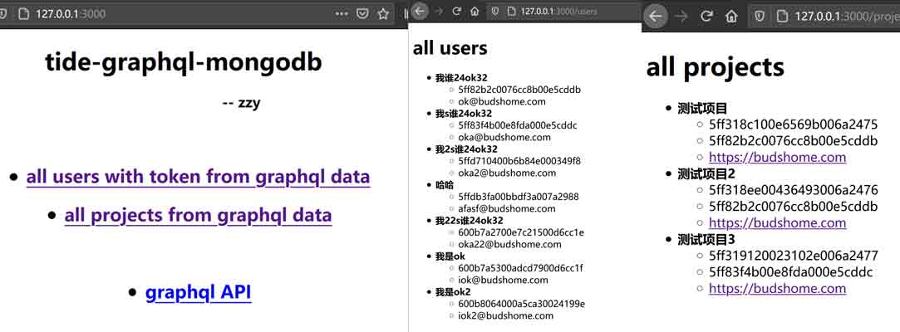

# Tide Server

``` Bash
git clone https://github.com/zzy/tide-async-graphql-mongodb.git
cd tide-async-graphql-mongodb
cargo build

cd frontend-handlebars
```

Rename file `.env.example` to `.env`, or put the environment variables into a `.env` file:

```
ADDRESS=127.0.0.1
PORT=3000

GRAPHQL_PORT=8000
GRAPHQL_PATH=graphql
GRAPHIQL_PATH=graphiql
```

## Build & Run:

``` Bash
cargo run
```
Then connect to http://127.0.0.1:3000 with browser.



## Contributing

You are welcome in contributing to this project.
